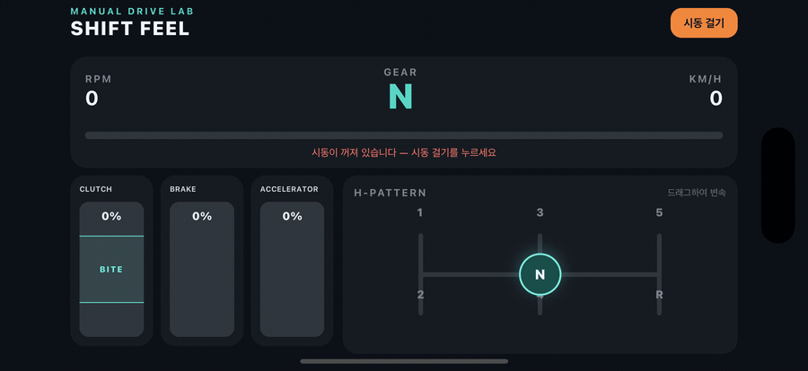

# Shift Feel

**React Native와 TypeScript로 구현한 크로스 플랫폼 수동변속 운전 감각 시뮬레이터입니다.**

[English README](../../README.md) · [아키텍처](../architecture.md) · [설계 결정](../decisions.md) · [로드맵](../roadmap.md)

Shift Feel은 H-패턴 기어, 클러치, 브레이크, 스로틀, 엔진 회전수와 변속 타이밍의 관계를 연습하기 위한 인터랙션 중심 프로토타입입니다. 레이싱 게임과 달리 랩 타임이나 정밀한 차량 물리보다 이해하기 쉬운 운전 피드백에 집중합니다.

> [!NOTE]
> 이 프로토타입은 실제 운전 교육을 대체하지 않으며, 실제 차량을 공학적으로 정확하게 모델링하지 않습니다.

## 목차

- [프로젝트 개요](#프로젝트-개요)
- [이 프로젝트에서 보여주는 역량](#이-프로젝트에서-보여주는-역량)
- [기술적 도전과 해결](#기술적-도전과-해결)
- [아키텍처](#아키텍처)
- [테스트와 품질 관리](#테스트와-품질-관리)
- [실행 방법](#실행-방법)
- [트레이드오프와 다음 단계](#트레이드오프와-다음-단계)

## 데모



_iPhone 16 Pro 시뮬레이터에서 실행한 iOS 빌드입니다._

## 프로젝트 개요

| | |
| --- | --- |
| **프로젝트 유형** | 크로스 플랫폼 인터랙션 및 시뮬레이션 프로토타입 |
| **지원 플랫폼** | iOS 및 Android |
| **핵심 기술** | React Native 0.86, React 19, TypeScript |
| **네이티브 연동** | iOS 및 Android용 선택적 FMOD 브리지 |
| **품질 관리** | Jest, React Test Renderer, TypeScript, ESLint |
| **현재 상태** | 개발 중인 기능 프로토타입 |

## 이 프로젝트에서 보여주는 역량

- 레이싱 기능이 아닌 구체적인 학습 경험에 집중한 제품 설계
- UI 및 네이티브 SDK와 독립적으로 검증할 수 있는 결정론적 시뮬레이션
- 클러치, 브레이크, 스로틀을 독립적으로 조작하는 동시 터치 처리
- 이동 경로 제한과 유연한 기어 영역 판정을 적용한 H-패턴 드래그 인터랙션
- 독점 오디오 의존성을 선택 기능으로 격리한 크로스 플랫폼 경계 설계
- 시뮬레이션, 입력 계산, 기어 선택, 오디오 생명주기와 UI 통합 자동 테스트

## 핵심 사용자 경험

| 영역 | 구현 내용 |
| --- | --- |
| **기어 선택** | 후진 및 1–5단을 지원하는 대화형 H-패턴 셀렉터 |
| **페달 입력** | 클러치, 브레이크, 스로틀의 독립적인 동시 조작 |
| **차량 상태** | RPM, 속도, 선택 기어와 엔진 상태의 결정론적 갱신 |
| **운전자 피드백** | 부드러운 변속, 변속 충격, 기어 갈림, 위험한 변속과 시동 꺼짐 판정 |
| **엔진 오디오** | 선택적 FMOD 브리지를 통한 RPM 동기화 및 개별 피드백 효과음 |

## 기술적 도전과 해결

### 1. 테스트 가능한 차량 동작

**문제:** 차량 상태, 변속 타이밍과 운전자 피드백이 계속 변화하면서도 렌더링이나 기기 동작에 강하게 결합되지 않아야 했습니다.

**접근:** 시뮬레이션을 결정론적인 TypeScript 상태 전이로 구현했습니다. 조정 가능한 값은 설정 파일에 모으고, 변속 평가는 시간 단위 상태 갱신과 분리했습니다.

**결과:** 같은 입력과 경과 시간은 같은 결과를 만듭니다. 앱을 실행하지 않고도 시동 꺼짐, 위험한 변속, 후진, RPM 제한 등의 경계 조건을 검증할 수 있습니다.

[시뮬레이션 코어](../../app/features/engine-sim/simulation.ts) · [설정](../../app/features/engine-sim/config.ts) · [시뮬레이션 테스트](../../__tests__/simulation.test.ts)

### 2. 멀티터치 컨트롤과 H-패턴 입력

**문제:** 수동변속 인터랙션에는 여러 페달의 동시 입력과 화면에 표시된 기어 레일을 따라 움직이는 셀렉터가 필요했습니다.

**접근:** 컨트롤 영역을 세 구간으로 나눠 각 터치 좌표를 독립적인 페달 값으로 변환했습니다. 셀렉터 좌표는 정규화한 뒤 H-패턴 위로 투영하고, 약간 겹치는 기어 영역을 이용해 판정했습니다.

**결과:** 페달 계산과 기어 선택이 React Native 컴포넌트에서 분리되어 순수 입력 변환 함수로 테스트할 수 있습니다.

[페달 입력 계산](../../app/features/pedals/pedalMath.ts) · [기어 패턴 계산](../../app/features/gearbox/gearPattern.ts) · [입력 테스트](../../__tests__/pedalMath.test.ts)

### 3. 선택적 네이티브 오디오 연동

**문제:** FMOD는 RPM 기반 엔진 오디오를 제공하지만 독점 SDK와 미디어를 저장소에 포함할 수 없습니다. 따라서 핵심 앱은 FMOD 없이도 동작해야 했습니다.

**접근:** TypeScript 퍼사드가 네이티브 모듈을 선택 기능으로 처리하도록 설계했습니다. 동시에 발생하는 시작 및 종료 요청을 관리하고, 최신 시뮬레이션 상태를 보관하며, 초기화 실패에서 안전하게 복구합니다. 플랫폼별 브리지는 같은 경계 뒤에 격리했습니다.

**결과:** 기여자는 FMOD 없이도 전체 시뮬레이션을 실행하고 테스트할 수 있습니다. SDK가 로컬에 설정된 경우에는 시뮬레이션 계층을 변경하지 않고 네이티브 엔진 오디오를 추가할 수 있습니다.

[오디오 경계](../../app/features/engine-audio/EngineAudio.ts) · [FMOD 설정](../fmod-setup.md) · [오디오 생명주기 테스트](../../__tests__/EngineAudio.test.ts)

## 아키텍처

```text
터치 컨트롤
     │
     ▼
입력 상태 ──► 차량 시뮬레이션 ──► 차량 상태 ──► 대시보드
                    │                    │
                    │                    └──────────► 변속 피드백
                    ▼
              선택적 오디오 경계
                    │
                    ▼
             네이티브 FMOD 브리지
```

결정론적 TypeScript 시뮬레이션이 차량 상태의 단일 출처 역할을 합니다. UI 컨트롤은 정규화된 입력을 제공하고, 대시보드는 결과 상태를 렌더링하며, 오디오는 선택적 네이티브 경계를 통해 RPM과 개별 피드백을 관찰합니다. 이 구조 덕분에 FMOD SDK가 없어도 제품의 핵심 기능을 실행하고 테스트할 수 있습니다.

[전체 아키텍처 문서 보기](../architecture.md)

## 테스트와 품질 관리

| 테스트 영역 | 검증 내용 |
| --- | --- |
| **시뮬레이션** | 엔진 생명주기, RPM, 가속, 제동, 시동 꺼짐, 변속 및 피드백 |
| **변속 타이밍** | 부드러운 변속, 변속 충격, 기어 갈림 및 위험한 변속 조건 |
| **입력 계산** | 페달 압력, 동시 터치, 기어 영역 및 제한된 셀렉터 이동 |
| **오디오 생명주기** | 네이티브 모듈 부재, 시작, 동기화, 효과음, 실패 복구 및 종료 |
| **UI 통합** | 컨트롤, 대시보드 출력 및 앱 단위 인터랙션 |

모든 정적 검사와 테스트를 실행합니다.

```sh
npm run typecheck
npm run lint
npm test -- --runInBand
```

## 기술 선택

| 기술 | 선택 이유 |
| --- | --- |
| **React Native + TypeScript** | iOS와 Android에서 인터랙션 및 시뮬레이션 코드를 공유하면서 네이티브 연동 지점을 유지합니다. |
| **결정론적 상태 모델** | 기기 없이도 동작을 재현하고 검토하며 테스트할 수 있습니다. |
| **Jest** | 순수 시뮬레이션 로직, 네이티브 경계, 훅과 컴포넌트를 검증합니다. |
| **FMOD** | 로컬 선택 의존성을 유지하면서 파라미터 기반 엔진 오디오를 지원합니다. |
| **CocoaPods / CMake** | FMOD가 설정되었을 때 iOS 및 Android 네이티브 오디오 브리지를 연결합니다. |

더 자세한 배경은 [설계 결정 문서](../decisions.md)에 기록되어 있습니다.

## 실행 방법

### 사전 요구 사항

| 요구 사항 | 플랫폼 |
| --- | --- |
| Node.js 22.11 이상 및 npm | 공통 |
| Xcode 및 CocoaPods | iOS |
| Android Studio 및 Android SDK | Android |

### 설치 및 실행

```sh
nvm use
npm ci
```

iOS 최초 설정 시 다음 명령을 실행합니다.

```sh
bundle install
bundle exec pod install --project-directory=ios
```

Metro를 시작합니다.

```sh
npm start
```

두 번째 터미널에서 원하는 플랫폼을 실행합니다.

```sh
npm run ios
# 또는
npm run android
```

> [!TIP]
> 시뮬레이션 실행에는 FMOD가 필요하지 않습니다. 네이티브 엔진 오디오를 로컬에서 활성화하려는 경우에만 [FMOD 설정 문서](../fmod-setup.md)를 참고하세요.

## 트레이드오프와 다음 단계

이 시뮬레이션은 공학적으로 정밀한 차량 물리보다 명확하고 조정 가능한 피드백을 우선합니다. 또한 소스 코드를 재배포할 수 있도록 독점 사운드 에셋을 저장소 외부에서 관리합니다.

다음 우선순위는 더 다양한 기기 검증, 가로 화면 및 동시 터치 안정성 개선, 명확한 학습 안내, 햅틱 피드백과 재배포 가능한 오리지널 오디오입니다. 전체 방향은 [로드맵](../roadmap.md)에서 확인할 수 있습니다.

## 프로젝트 문서

| 주제 | 문서 |
| --- | --- |
| 시스템 설계 | [아키텍처](../architecture.md) |
| 기술적 판단 근거 | [설계 결정](../decisions.md) |
| 개선 계획 | [로드맵](../roadmap.md) |
| 기기 지원 범위 | [기기 QA](../device-qa.md) |
| 배포 | [릴리스 빌드](../releasing.md) |
| 네이티브 오디오 | [FMOD 설정 및 배포 규칙](../fmod-setup.md) |
| 기여 및 정책 | [기여 안내](../../CONTRIBUTING.md) · [보안](../../SECURITY.md) · [개인정보 처리방침](../../PRIVACY.md) |

프로젝트 문서의 기준 언어는 영어입니다. 한국어 문서는 주요 내용을 번역한 보조 문서이며, 내용이 다를 경우 [영문 README](../../README.md)를 우선합니다.

## 라이선스

소스 코드는 서드파티 소프트웨어와 에셋을 제외하고 [MIT 라이선스](../../LICENSE)에 따라 배포됩니다. FMOD SDK 파일과 FMOD 예제 미디어는 포함되지 않으며 각각의 별도 이용 조건이 적용됩니다. 자세한 내용은 [서드파티 고지](../../THIRD_PARTY_NOTICES.md)를 참고하세요.
